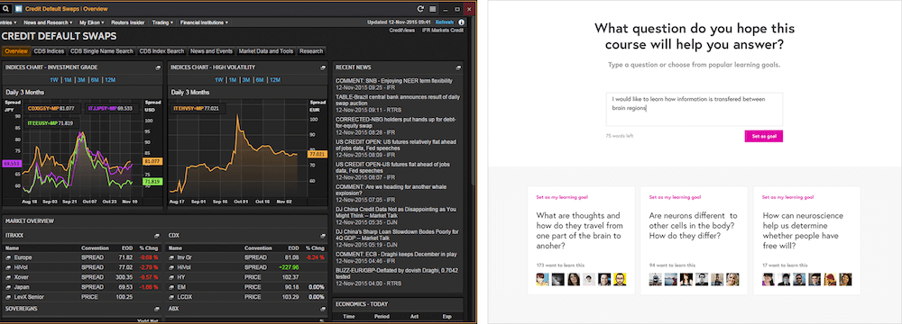
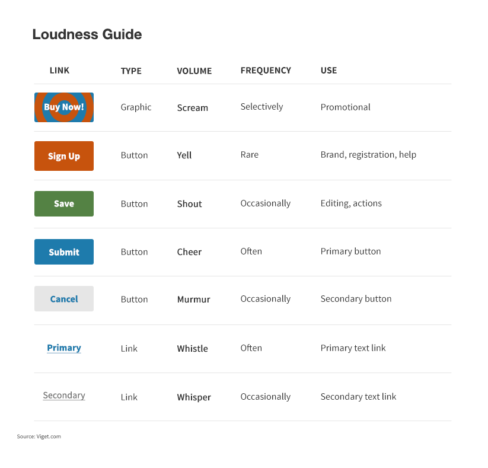

# 第一章节 - 设计系统

设计系统包含：内在关联模块(interconnected patterns) 和 共享方式(shared practices)

模块：组成界面的可重复性元素，包含 用户流程、交互、按钮、文本框、图标、颜色、版式、微复制品。

共享方式：我们如何创建、捕捉、分享和使用这些模块，特别是在和团队工作的时候。

 

Thomson 的主要目的是为了处理数据，效能，快速扫描和多任务操作。
FutureLearn 的主要目的是为了仔细阅读，非正式学习，和其他志同道合的人产生联系。

产品的 __目的__ 决定着它所选用的模块。

Thomson 的版面看起来以面板和小部件为主，为了让用户可以多任务操作。设计看起来很稠密，屏幕上展示了许多的信息。很小的间距，紧凑的控制，弹性的布局，排版的选择，就像使用浓缩字体和相对较小的标题，这些都能产生稠密的效果。

FutureLearn 的版面看起来更广阔。每个页面通常专注在一个任务上，就如同读一篇文章一样、参与一场讨论或是完成一个互动练习。主要是单栏的布局；高对比的排版，大的标题文字，宽大的控制，和巨大的留白空间。

功能模块(functional patterns) 由产品所属的领域来决定。例如，市场趋势分析软件，就习以为常的有任务栏、数据字段、表格、数据可视化的工具。对于在线的学习平台则有，文章、视频、讨论区块、进度条、互动活动等。

产品的精神(或者说品牌) 称作 知觉模式(perceptual patterns)。例如，腔调、版式和颜色、图像风格、间距和版式、具体的形状、互动、动画和声音。

## 设计模式(design patterns)

大部分的设计模式都是已经建立的和熟悉的。它们运用人的心理模型，让设计可以更直观的被理解。一系列内在连接的模式组成了产品界面的设计语言。

[Visual loudness guide](https://www.viget.com/articles/visual-loudness/)

具体来说，我们主要看两种设计模式：功能和知觉。功能模式表现为页面的具体模块，就像按钮，顶栏，输入框，菜单。知觉模式是描述性风格，可以直观的传达和表达产品的个性，就像颜色，排版，图像风格，形状，动画。

从前端的视角来看的话，模块总是在 HTML 中，知觉模式在 CSS 特性中。

一个设计系统包含了许多的模式：用户流程(包含错误和成功的信息样式的表单)，领域型设计模式(就像教育平台，电商平台)，有说服力的用户体验模式。

## 共享语言(shared language)

共享语言可以跟有利于团队的合作。有了共享语言意味着我们有同样的方法来为界面元素命名，而且这些命名可以延续至设计文件和前端的框架。

理想上，参与产品大件的每个人都应该知道这是什么元素：它的名字和用途，为什么被设计称这样，它可以怎么或者何时来使用。

[MailChimp's pattern library](https://ux.mailchimp.com/patterns) 是比较早期并且有影响力的在线模式库的例子。

## 模式库的局限

模式库主要是为了让设计更一致。但是它不能让坏的设计变成好的设计。

## 有效的设计系统的组成

设计系统的各个部分如何组合来达成产品的目的，可以用来衡量该设计系统是否有有效。

### 分享目的

在高效的系统中，我们可以看到子系统连接并朝向共同的目标：设计方法在前端架构中呈现；设计模式遵循指导原则；模式语言在设计、代码和模式库中一致的运用。我们看到这些系统的运作方式的和谐：它们的工作流程更有效率；它们创造的用户体验更有意义和连贯性。

### 定义问题

