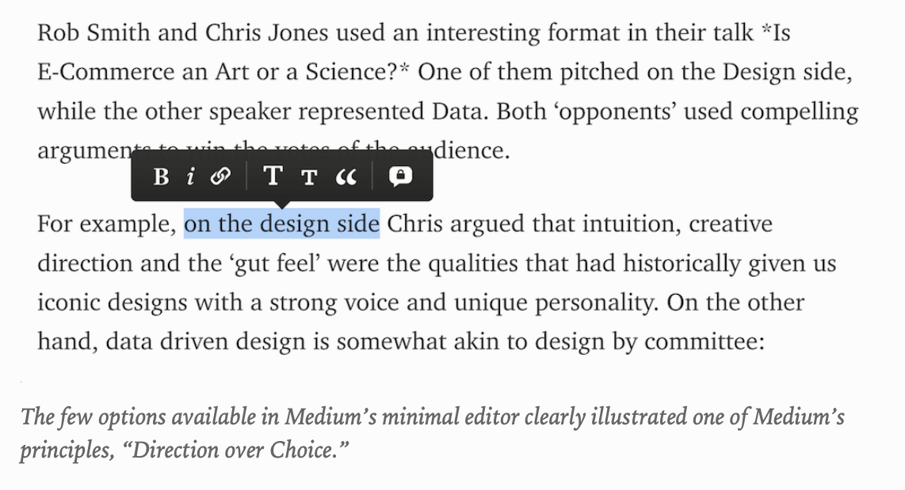
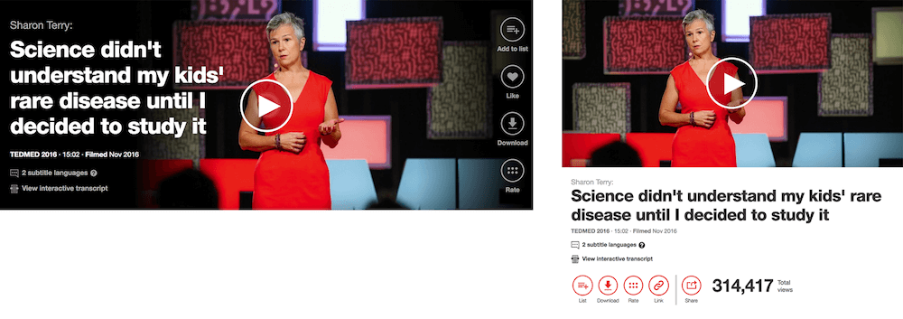

# 第二章节：设计原则

```
实用的设计原则是所有运作良好的设计系统的基石。在这个章节我们将讨论有效的设计原则的质量，并研究一些定义它们的方法。
```

前面我们谈到了从目的和精神开始产品的界面设计的重要性。明确目的是至关重要的，因为所有的决定都应该由它来塑造，即使是间接的。我们如何确保产品的目的通过设计得以实现呢？通过建立一些基础的价值观和原则。

在一些公司的早期，尝试阐明共享指南 (shared guidelines) 可能很难。设计原则是不可以测量和量化的东西，定义他们需要好几代的迭代。关于原则究竟是什么可能也存在一些混淆。根据公司的不同，他们有一些关注于品牌，有一些关注于团队文化，另一些则关注于设计过程。Pinterest 的原则更专注于品牌（"Lucid," "Animated," "Unbreakable"），然而英国政府数字部门 (GDS) 他们更着重于团队运转 （"Do less," "Iterate. Then iterate again"）。

有时候，对于一些特定的项目，原则会在有一些有限的时间内使用。设计师 Dan Mall 喜欢在每个项目一开始的时候就写一个“设计宣言”，以确保明确表达创意方向和目标。在其他情况下，原则更为持久，它甚至发展为公司精神的一部分。就像 Jack Daniel 提出的 “自信”、“独立”、“诚实” 这些原则，这些价值在上个世纪都未改变。

较大的公司，可能会为用户体验、品牌、设计系统定制单独的原则。此外，在公司里里的每个团队可能也有他们单独的原则。虽然这个适用于某一些公司，但是多套设计指南可能也会导致设计系统碎片化。在 Atlassian，一家企业软件公司，营销和产品部门的设计原则是完全不同的。随着时间的推移，团队将他们拉的更为紧密，他们现在正在制定一套统一的原则，目标是采用共同的理念来弥合营销，产品和支持等部分之间的差距。

> 这是一个系统。原则的目的是将所有的点连在一起。
> - Jurgen Spangl, 设计主管，Atlassian

除了为不同的团队和部门制定不同的原则，Atlassian 旨在有一些关键的价值观——例如 **大胆地** **乐观地** 和 **简单实用地** —— 这些贯穿于用户旅程的所有接触点中。虽然这些价值观在所有的用户旅程中是相同的，但是他们在不同的阶段强度也不一样。网站的销售和营销部门更为 “大胆”地去展示产品和帮助用户了解他们的价值观。但是当你接触产品本身和支持部门，体验就变为更关注用户的完成工作，并确保人们能够尽可能的有效率。因此，大胆度降低，实用性升高。就如 Atlassian 的设计主管 Kevin Coffey 所说：没有人想要一个大胆的支持页面。

## 有效设计原则的品质

达到设计原则的方法对于每个公司都是不一样的，它们可能有多种形式。原则可以是总体的，也可以是细化的，暂时的或者持久的。重要的是它团队中统一设计思维和分配创意方向的效率。在这本书的上下文中，设计原则是 **共享指南指出了对于团队来说什么是好的设计，以及如何实现它的建议。** 换言之，在您的组织和产品中构成良好设计的商定标准。

无论采用何种方法， 有效的设计原则通常都有这些特性。

### 1. 它们真实不虚

我相信你对这些原则很熟悉：“简洁的、有用的、令人愉悦的”。我们经常听到它们，它们无处不在。毫无疑问，良好的设计都遵循一定的共同原则（例如，Dieter Rams 的良好设计的十条诫命就是很好的例子）。但是这些品质应该是给定的–它们应该用设计来完成–而不像其他方面，例如可访问性和性能。我还没有看到过一个数字产品，它的原则是“复杂”，“无用”，和“使用起来很痛苦”。

你的产品有用的和有趣的，它并不会对你的设计决定提供很大的帮助和指导。因为这些这些品质可以通过多种的方式来解释。能够让他们有用得是，让团队指导这些词，确切想表达的内容。创新需要什么？什么时候设计被认为有用？你怎么指导它真的令人愉悦？良好的设计原则定义了可以用不同方式解释的品质，并将其置于特定产品的背景下。

让我们以 TED 作为例子。TED 的一个设计原则是 “永恒而不是前沿。” 永恒这个词指的不是 TED 的界面，而是它们整个品牌想要通过设计而达成的目标。这也就意味着它们不会采用新的技术或者引入新的设计元素以追随潮流。首先它必须为一个目的服务，也就是它必须为尽可能多的用户服务。对于 TED 来说，永恒不仅仅意味着简洁，并且时刻意识到样式特点不会无经证实就呈现给用户。例如，团队不会引入视差效果，就算它在现在非常的潮流，除非它能解决一些真正的设计问题。


### 2. 它们切合实际并且是可行的
原则应该就如何在特定产品的背景下解决设计问题提供切实的指导。对比这两个版本的 FutureLearn 的原则：

> 简约一点。让它简约到几乎注意不到！我们应该始终努力消除平台上造成的摩擦部分，创造一种允许用户真正获取内容的体验。如果我们平台易于理解，用户就会更多的使用它。

这个声明很完美–没有人可以反驳一个简单易用的界面的必要性。但是，这个声明不够清晰，它没有告诉我们什么才是简约，应该如何才能达到简约。对比这个版本：

> 没有冗余的部分。每一个设计元素，从最大的到最小的，必须要有目的性，并且要为更大的部分服务。如果你不能解释清楚那个元素的作用，那么它也许就不应该在那儿。

在实际中，“是否足够简约？” 比起 “它是否包含了必要的部分？”。 后者更容易在界面的每个元素中进行检验。

为了让原则表达的更切合实际，尝试着让它们更具体并且能够提供一些**行动建议**，而不是仅仅听起来很棒。想象一下你要为加入你们团队的一个新人分享五个设计你们产品的要点。如果你只告诉他们“我们想要令人愉快的设计。让设计变得让人愉快！”，这样恐怕不能够帮助他们完成工作。你需要定义清楚什么是“令人愉快的”，并且分享一些实际的“令人愉快的”案例给他们，让它在你们的界面中它的定义。

让我们来看一下下面的一些设计原则的案例，以及如何让它们变得更实用。

模糊的：“**让它更清晰**”  
可行的：“**只有呈现一个优先级**。你希望用户首先看到什么和做什么”

模糊的：“**让它更简单**”  
可行的：“**使它牢不可破**。就像小朋友的玩具，确保它是为了探索而设计，不会发生意想不到的点击。”

模糊的：“**让它更有用**”
可行的：“**从需求开始**。如果你不知道用户的需要是什么，你将无法构建正确的东西。做研究，分析数据，跟用户交谈。不要去自行假设。”

即使是最好措辞的原则也可以用多种方式来解释。没有什么比让这些设计原则在实际生活中应用和找到对应的例子。找到界面特定的部分，并且是清晰的应用了原则。你可以指出那一个部分清晰的表明了“只呈现一个优先级”。你可以示范一下哪一些部分真正地“牢不可破”，尽管它有丰富的互动。


### 3. 它们表达了一个观点

设计是由我们决定的。这个界面是该更具视觉活力还是更实用？更有趣还是更严肃呢？我们是否可以在产品的易用性和灵活性之间做取舍？为了达成某一个目标，我们经常要拒绝某一些部分。好的设计原则可以帮忙理清设计优先级和它们之间的平衡，即使存在相互矛盾的因素需要考虑。

让我们以 [Salesforce Lighting 设计系统](https://www.lightningdesignsystem.com/getting-started/) 的原则作为参考：“清晰、有效率、一致、美”。这个顺序也强调了优先级。美不应该在有效率和一致性之上，清晰始终是位于第一者。以这种方式对原则进行排名可以向团队传达在制定设计决策的时候应该优先考虑的事项。

设计原则可以有效的帮助认识冲突，并且找到其中的平衡点。Medium 早期的设计原则是“方向优先于选择 (Direction over Choice)” 当团队在设计文字编辑器的时候经常会提到这个原则。他们故意交换各种格式选项，以指导人们更专注的写作。



*Medium 的编辑器只提供了很少的设置选项，清晰的表明了它们的原则 “方向高于选择”*

好的设计原则不需要展现的面面俱到。它们为设计师权衡轻重提供了有效的参考。Dan Mall 在“研究设计系统” 中强调了这个方法：

> “设计系统应该有以下的指导：权衡轻重、观点、向每个决定用设计系统来构建一些东西的人扩展思路。那些东西应该慢慢研磨，否则，我们都可以就使用 Material Design 来应付了事”
> - Dan Mall

### 4. 它们是可靠并且值得铭记的

这儿有一个有趣的测试。尝试问你们公司的同事你们的设计原则是什么。如果没有人记得它们，意味着设计原则需要改进。如果要人们对它印象深刻，就要持续不断的使用它。它们应该在每天的对话当中被提及，包括在简报中和在设计批判中，呈现在易于被看到的地方。要保证时常被用到，它们必须真正的有用，且在以上条件中使用。

原则不用太多。人的记忆能力有限，如果每次需要记住多余4个东西的话，会很吃力。设计原则的最佳数量–如果你想让它们被持续使用–最好的话是3-5个。当我们为本书采访 TED, Atlassian, Airbnb 团队成员的时候，他们都可以即刻想起设计原则。没有人会需要看品牌手册来回忆起他们。他们问什么能记的如此清晰呢？他们的原则都很简单、可靠、有用–并且并不多。

更为重要的是，团队在每天的设计决策过程中都使用着他们。Airbnb 的四个设计原则 ("Unified," "Universal," "Iconic," "Conversational") 深入的参与到他们的设计过程中：

> “当我们在设计新的元素的时候，我们需要确保这个元素满足了我们的原则。如果我们没有一套设计原则的话，就很难达成一致。我们要确保每个部分都符合我们的原则。“
> – Roy Stanfield，主交互设计师，Airbnb

Spotify 的原则采用字母的缩略词 TUNE (tone, usable, necessary, emotive) 来使得设计原则更加难忘。在评论和 QA 中，确认设计是否包含了 "TUNE" 已经成为 Spotify 设计过程的一部分。

为了让设计原则达到以上的质量，需要花费大量的时间、精力和团队工作。但是它值得为之付出，一套核心的设计原则是所有设计系统的中心。


## 定义你的设计原则

用五个句子传达你的设计方法并不容易。每个团队形成他们设计原则的方法并不相同：一些通过几轮的工作坊，一些通过 CEO 或者创意总监的直接传达。不管你用何种方式形成设计方法，下面的一些技巧记在心中可能对你有一些帮助。

### 从目的开始

设计原则必须支持产皮更大的目的，并有助于传达产品的精神。如果你不知道从何处开始，请了解公司的总体价值观和产品的愿景，然后尝试弄清楚设计原则如何为更大的目标服务。

TED 的网站的主要目的可以用一句话来概括：“尽可能广泛的传播想法”。就 TED 的精神和价值观而言，意味着接触越多的使用者越好，降低接触的门槛，使产品具有包容性和可访问性。这意味着优先考虑性能和可访问性而不是华丽的功能，清晰的传达信息而不是大胆的试验型设计。他们的“永恒的原则”包含了这一点。

### 找到合适的主题

如果你还在定义原则的阶段，一个有效的练习是去询几个团队成员（或者团队中的每一个人，若团队人数不多的话）并把它写下来。在他们看来，对于你们的产品什么才是好的设计？他们如何用五句话以一种实用且易于掌握的形式来向新同事展示。

让他们在产品界面中为每个原则找到切实存在的例子。

比较你团队的答案可以揭示你们在设计方法上面的统一程度。是否有很多共享的主题和重叠的部分？每个不同的部门是否有类似的原则？看到每个人不同的回答总是很有趣，特别是对比那些刚加入团队的那些人和陪伴产品成长的那些人之间的看法。这些看法可以成为进一步开展原则工作的起点，因为你可以确定共同的主题，并且就优先级达成了一致。

### 聚焦于正确的听众

结束模糊的的设计原则的方法是不知道他们是谁。你在为企业宣传册写作吗？为公司网站吗？职业网站吗？潜在的合作伙伴或者客户吗？尝试为你和你的同事写出设计原则，首要的是：设计师，开发者，内容生产者，市场专业人员，领域专家–那些直接参与在产品研发的人员。旨在就产品的优良设计达成非正式的协议，并提供实现产品的实用指南。

### 测试和使用你的原则

随着你的产品不断的发展，你的原则也是。他们将塑造设计语言，反过来也将塑造原则。他们可能开始变得清晰和专注，也可能随着时间的推移变得更加稀释并失去其真实性。为了确保你的设计原则持续不断的改进，他们需要不断的进行测试、评估、重新定义。这只能通过意识到它们并在每天的工作应用它们来实现。为了使你的原则成为关键设计的一部分，例如，你可以持续的测试他们是否对你的设计流程有帮助，没有的话就迭代它们。


### 从原则到模式

作为设计师，在我工作的挑战之一就是如何将更高层次的概念（如，设计原则和品牌价值）实现到具体的 UI 元素中。他们是如何体现在我们创造的设计模式中的？

很多时候是关于模式的选择和执行。对于 Medium，在功能层级，一个功能良好的编辑器是需要的。它可以是任何形式的编辑器，具有任何的复杂度。但是出于所有可能性，Medium 选择了样式最为简单的，“方向多余选择”

对于 TED，信息的清晰性优先于美感的考量。试图将谈话提炼成单个句子可能很难，有时标题可能很长。把标题剪短看起来更容易，但是对于团队来说，谈话的信息必须始终优先。他们没有选择容易的解决方案，而是确保他们的设计模式中包含了可以容纳长标题。



*TED.com 上面的横幅可以容纳足够长的符合他们设计原则的标题*

从品牌的角度来看，还有一种优先顺序。例如，TED 团队选择不使用图像化的主页知道他们开发了新的压缩技术来尽可能的减少众多图像对性能的影响。

对于 Atlassian 团队，“乐观”的原则体现在“乐观的界面中”。在 JIRA，例如，有用户想要把卡片从“正在进行中” 移动到 “完成”，卡片可以立即移动，即使在背后需要有很多的检查和验证工作，也许可能会有很多差错。他们的目标旨在呈现“眨眨眼就行了”的原则，通过友好的文案，反馈信息，登陆信息和网站上面其他的信息。


