# 第三章：功能模块

```
在这一章，我们将讨论功能模块的角色和为什么他们应该在设计流程的初期被定义。
```

功能模块式是界面的基石。它们的目的是为了启动和鼓励用户行为。

在十分钟烹饪网站，有一些行为包括选择配料、选择食谱，然后在给定的时间跟随步骤来完成。我们设计的功能模块将会通过这些行为来告知。功能模块，或者模块[^1]，主要由产品所在的领域来决定。我们烹饪应用的模块会跟金融软件很不一样。金融软件将要处理任务栏、数据字段、网格、图标、图形，而不是食谱卡。

功能模式(Functional patterns) 可以简单或者它们可以组合去建立一些更复杂的模式。食谱卡由餐名、图片、食材和动作按钮组成。每个食谱卡中的模块都有它独特的目标：标题告诉我们这是什么菜式；图片提供给我们最后成果的预览；食材图标允许我们快速的浏览卡片。这些模块一起组成了主要的目标：鼓励人们去烹饪食材卡上的菜肴。

随着产品的发展，模式也在慢慢发展。我们也许开始允许我们的用户去给食谱打分，而这些评分也会成为食谱卡的一部分。或者我们决定对食谱卡的布局进行提升，或是配料的图标需要更清晰的表示，或者是我们需要介绍其他版本的卡片。我们测试和迭代模式来让他们更好的工作来达成他们的目标；也就是鼓励更有效率的用户行为。

在设计过程的早期阐明模式的目的，可以更好的防止产品增长过程的重复。一开始，它也许看起来不值得付诸努力；毕竟，产品在早期变化太快，无法确定所有界面部分。但是核心功能模块真的有改变吗？让我们以 FutureLearn 为例子，来看看界面在初始三年内是如何演变的。

## 模式发展，行为保留

自从 FutureLearn 在2013年被 Open University 创建以来，它的愿景就是 “鼓励所有人通过讲故事，互相交流，庆祝进步来进行学习”。为了能够达到这个目标，我们至少要保证人们可以发现和加入我们的线上课程，激励他们进步，并使学习体验变得有趣和有益。这个愿景为 FutureLearn 提供了最初的功能模式。

课程按单元排列，并有一个线性的流程–一部分通向另一个部分。在界面层级，这转换为每周的不同结构。每周分为不同的活动，每个活动分为不同的步骤。课程进度模块是其中一个核心模块：它可以让学习者导航课程内容，显示他们的进度，以及课程当前的活动的位置。

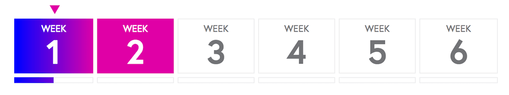

*FutureLearn 的课程进度模块*

这些模块在他们被设计之后的三年经历了一些变化。他们的风格，甚至是功能和交互都已发生了变化。然而他们的目的基本还是保持一致，因为这和 FutureLearn 是如何运作的核心理念相关联。

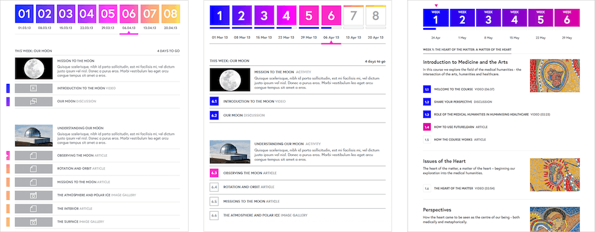

*To Do 页面在过去三年经历了多个不同版本，但是核心目的还是和原来是一致的*

同样，FutureLearn 上的讨论主题随着时间的推移不断的发展，因为参与人数增加了：跟帖的布局，交互和过滤功能都已经发生了改变，但是他们的核心目的大致一致 – 鼓励学习者参与对话，并允许他们互相学习。

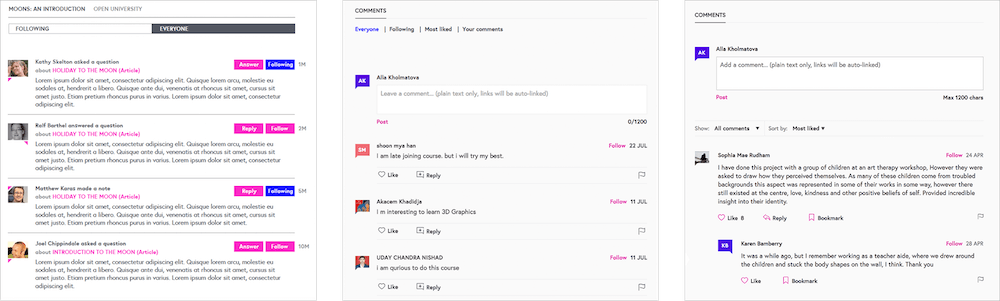

*讨论页面在创建之后经过多个版本的迭代，但是核心目的模块还是没有改变。*

展示课程详情的核心单元也同样经历了三年的发展，允许用户在需要向下滚动页面之前查看更多可供选择的课程列表。但是同样，模块的核心目的还是一样 – 允许人们发现和加入任何他们感兴趣的课程。

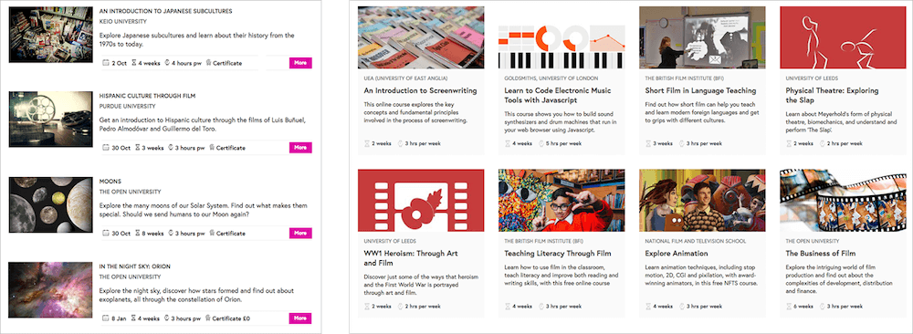

*课程列表经历了几年的发展，允许用户来看更多可供选择的课程列表。*

正如早期创业阶段，因为时间的限制和其他的优先事项，许多核心功能模式尚未定义。随着 FutureLearn 界面和教育功能的增长，模式变得重复。我们最终得到几个课程进度模块，评论模块的变体。以及整个网站上的一些不同的课程块和课程卡。也许这些都是必要存在的。或者有一些重复的部分可以被移除？

当模式没有在团队中被定义和共享时，你开始重新创造它来达成一些类似的目标：另一个促销模块，另一个新闻源，另一个组共享链接，另一组下拉列表。在你了解它之前，你最终会有30中不同产品显示和弹出式菜单。

模式是我们试图通过界面鼓励或启动行为的物理体现。他们的执行，内容，交互和呈现可以改变。（实际上，模式甚至可以不是视觉的呈现的，它们可以是声音读出，或其他方式来体现。）但是它们旨在鼓励用户的核心理念需保持一致，因为它们源于你产品最初的目的和它的工作原理。了解关键模式的目的可以帮助你了解系统的工作方式，并防止系统在演变过程中出现碎片。


## 定义功能模块

在设计初期定义模式并不需要花费太多的时间。有一些技术无需太多的努力就可以集成到你的工作流程中。以下是一些我觉得特别有用的内容。

### 创建模式地图

要梳理客户的需求，目标和东西你可能要完成 [客户体验地图](../assets/ch03-04_5-Adaptive_Paths_Guide_to_Experience_Mapping.pdf) [^2], “要完成工作” [^3]，或是一些类似的客户旅程训练。这些结果通常会提供给早期的设计探索和原型。在这一点上，我们通常会非常清楚地了解我们希望为用户鼓励和启用的行为：学习课程，加入课程，参与讨论。但是当我们聚焦在界面上的时候，我们往往会遗漏了一些细节。我们花时间来制作令人印象深刻的页面标题，而忘了页面标题是用来做什么，或者它是怎么影响到不同部分的用户旅程中。换句话说，我们丢失了用户行为和鼓励或启用用户行为模式之间的联系。

要了解你的模式如何适应大局，请尝试将一些核心模块映射到用户旅程的各个部分。想想每个部分的用途，以及它旨在鼓励的行为。你不需要在这个阶段担心每个图标或者按钮的样式。关注在大局上面：了解系统的各个部分，和他们如何一起运作。对于 FutureLearn，主要聚焦在三个部分：发现内容，学习课程，达到目标。

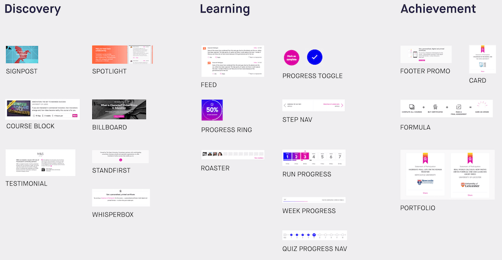

*一些 FutureLearn 的功能模式映射到三个用户旅程的关键阶段*

在我脑海中保留这个地图可以帮助我思考了由共同目的而不是单独页面加入的模式系列。例如，我不是设计课程列表页面，而是将整个“发现”部分作为一个整体。在用户旅程的这个阶段，我们需要鼓励用户的哪一些行为？哪一些模式可以支持这些行为？还有在网站上哪一些地方存在，它们是如何工作的？如果是新的模式，如何让它服务于整个大的体系？对所有这些问题的思考是系统设计的一部分。

### 界面清单规整

[界面元素规整](http://bradfrost.com/blog/post/interface-inventory/)[^4]，由 Brad Frost 描述，已经变成一种普遍的方式来让界面模组化。方法很简单。在纸上打印出界面，或者把它们收集到 Keynote 或者 Powerpoint 里面。然后你可以通过在 keynote 中将它们切开或者粘贴分类。

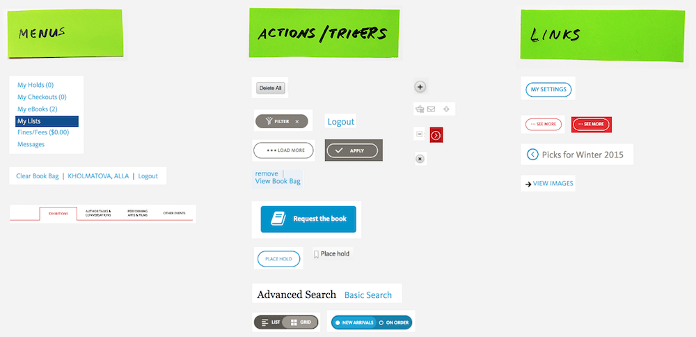

*界面清单展示了一些互动元素*

你最终得到了一系列可以分为不同类别的文件：导航，输入框，标签，按钮，列表等等。完成这个步骤你可以看到一些重复的模式，并且找到需要特别注意的问题。这就是你开始发现你有许多的顶部导航，或是弹出菜单，并且开始思考如何让这些元素更规则。

清单不必包含全部的元素（虽然你做的第一个应该是要全面的）。它可以一次只要聚焦于一个模式，就像推广模块，顶部，或者是所有产品展示列表模块。你可以做一个清单，聚焦于字体，颜色，或者动画。

为了更有效率，界面清单应该定期进行维护。尽管你的团队维护了一个模式库，也会有需要整合到系统中的新的模式库。如果你养成有每隔几个月运行一次整理库存的习惯，每一次应该不花费几个小时。每次你这样做，你将会更好的理解你的系统，并且可以改进它。[^5]

### 把模式是做一种行动

要理解模式的目的，尝试关注它的作用而不是你的想法。换句话说，尝试找到最能描述模式设计 **行为** 的操作。用动词而不是名词来描述模式，可以帮助你扩大潜在的模式用例，并且更精确的定义它的目的。

假设你已经推出了一个简单的模块来推广在线课程。如果你尝试描述它是什么，你可以将其描述为“图像标题”或者“课程横幅”。

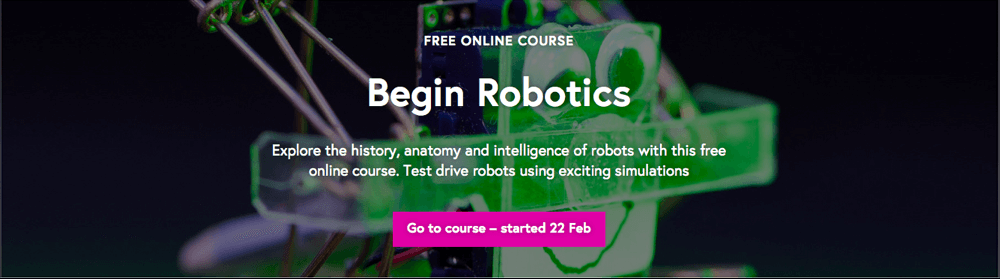

*FutureLearn 上面用来推广在线课程的界面元素*

但是通过这种方式来描述模式，你可能使其过于特定于其呈现后者是内容。你最终可能会限制其在特定环境中的使用。另一方面，如果你根据行动来定义它 – 从用户的角度和你自己的角度 – 你可以发现它的目的：“推广课程” 和 “发现课程”；“鼓励人们加入课程”和“鼓励人们加入”。通过专注于行动，你将模式和行为联系起来，并为各种用例保持开放。这个模式还能促进什么？在线讨论？新的活动？你给它的名字应该也能体现这一点。在上面的示例中，我们将模块命名为“Billboard”，以反应其以行动为中心的促销功能。


### 画出模式的结构

为了共享理解模式的原理，请绘制其结构：模块需要有效的核心内容类型。

设计师，开发和内容策略师可以在处理新模块或重构现有模块时协同工作。列出模块需要有的核心内容元素。例如，你可能会同意你的界面推广模块像“Billboard”需要：

- 一个标题
- 一个强烈的 CTA
- 一个引人注目的背景(实色或者是图片)


接下来，尝试确定元素的层级并决定它们是否应该被结构化；例如：图片是内容的一部分吗？标签是否是必要的呢？在做这些的时候，制作一些草图来形象化一些结构。

为了让你更加了解它的外观，下面是 FutureLearn 上课程列表项模块的内容结构示例。

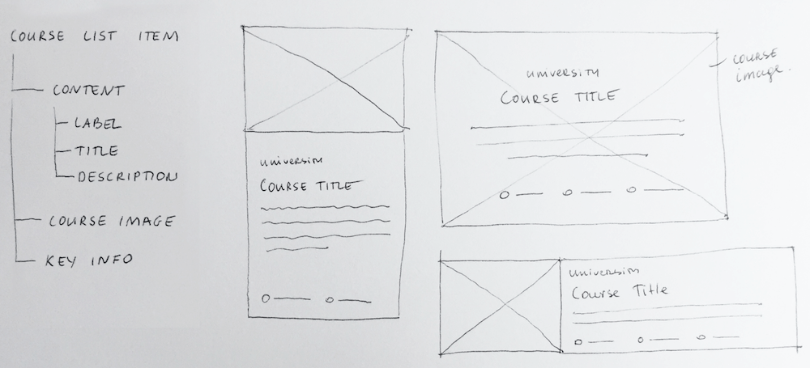

*FutureLearn 上课程列表的内容结构示例*

此时你可能会想：“它只是一个草图或线框。我一直这样做。” 但是它们有一些不一样。这个草图主要专注于模块的内容结构，以及元素的层次结构和分组。

一旦你对模式的结构有了共同的理解，就可以很容易的确保模块的设计方式反应在标记中。设计师可以进行视觉呈现的探索，而开发人员可以整理原型（或者两者都可以原型化，取决于你的工作方式）。设计师可以了解他们需要多少的视觉探索来让模式视觉呈现更好。 开发人员就知道为什么这么设计的原因，并且不会接收到意想不到的设计。每个人都知道这个模式是如何构建的，以及它将影响到其他的地方。”

这儿是另一个例子。在 FutureLearn 我们过去在网站的不同地方有四种不同版本的社交推送 – 两种版本的 “评论”， 一个“评论”和一个“通知”。

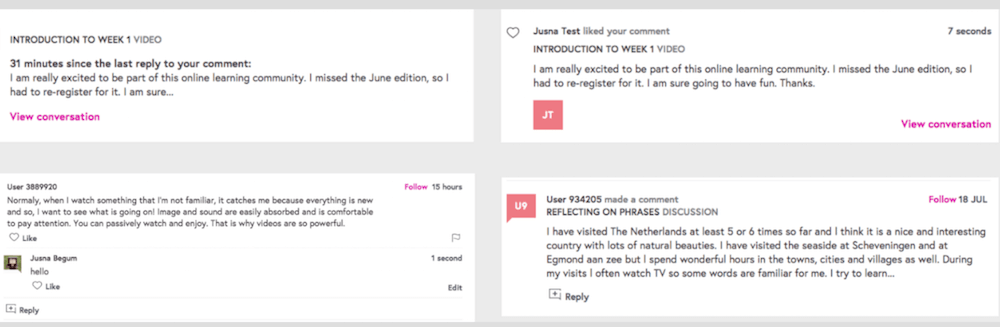

*FutureLearn 上4种不同版本的社交推送*

虽然乍一看他们看起来很相似，但是他们的风格却不太相同；也就是说，如果你改变其中某一个的话，这些修改不会应用在其他的几个上面，他们在留白，字体等视觉上看起来都不一致。

把他们拆解开，并且画出他们的结构可以让我们看到它们是否可以统一成一个模式中，并以适用于四种用例的方式设计该模式。[^6]

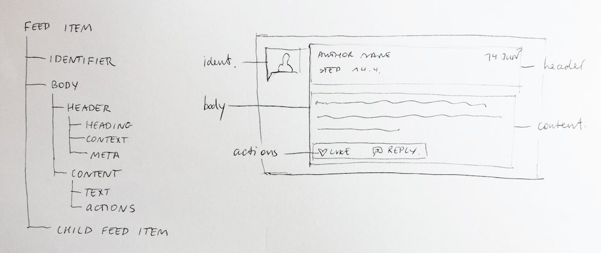

*FutureLearn "Feed item" 模块的内容结构*

正如这些例子所示，内容结构与模式的目的密切相关。 了解模块的结构有助于我们了解模块的工作原理。


### 在一定规模上放置模式

尝试在一定规模上放置相似模式。例如，你的系统里面可能有一些具有不同强度的促销模式。类似于第一章节我提到的 [视觉强度等级](http://smashed.by/visualloudness)[^7]，促销模块可以相互地比较。

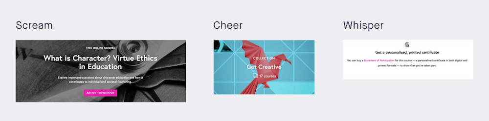

*促销模块可放置在虚构的视觉强度面前*

把模式放在不同等级上面可以帮助我们确保它们被合适的使用并且不会在系统中争夺竞争力。它同样也帮忙阻止不必要的模块被重新建立，因为你已经看到合适可以有相同“音量”的模块。

另一种方式是，你可以想象你的界面不是视觉的，而是通过声音把它读出来。什么时候需要发音更大声一些，什么时候需要改变一些语调。考虑如何通过模块中元素之间的关系以及它们在整体设计中的层次结构来直观地表达音量和语调。 当然，以这种方式思考它还具有使屏幕阅读器更容易访问的额外优势。

### 把内容当作一种假说

这是一个悖论。我们期待内容优先的设计，但是同时我们期待建立一种可以适用于任何内容的模块。这样做的方法不是从内容开始，而是从目的开始。然后我们可以将内容视为一种已有的素材而不是假设。这使我们可以测试是否很好的定义了模块的用途，以及设计是否适用于该目的。

假设我们一个模块，设计的目的是展示产品特性。


*用来展示产品特性的模块的例子*

我们可以将其目的定义为“使用额外的易于浏览的信息来支持主要信息”。“小块(bits)” 可以是关键特性，简短的建议，或者一些简要步骤。我们可以为内容建立适合这种假设的模式（精简易于浏览，附加内容而不是主要内容），然后测试它。

如果内容始终不适合此模式，则通常由以下三个原因引起：

- 我们没有准确定义模式的目的。返回去尝试理解它是为何被定义。
- 我们没有准确设计模式来达到它的最佳目的。尝试用不同的模式设计。
- 我们试图将内容转化为一种不太适合的模式。考虑修改内容，或尝试其他模式。

当我们没有从目的和结构出发的时候，我们最终将会得到与其内容联系内容太过紧密的模块。例如，我们有一个案例，是关于 FutureLearn 的内容和下方的标签页联系太过


*脆弱模块的例子，内容太过于具体了*

这些标签应该保持可见。为了解决这个问题，我们几乎引进了一个自定义的小尺寸标题，只是为了稍微推动标签的可见性。但是如果我们这样做，我们将会得到一个不健全的模块。如果标题变得更长或者我们增加了新的一行，我们就会遇到同样的情况。如果我们从模块的目的和结构开始，标签可能已经放在顶部了，因为它们是设计中的一个重要的元素。

已经有一些现有的工具和技术你可以试着在你的界面上面定义功能模块。最重要的是理解模式如何和他们的最初的设计行为联系在一起：它们的目的。

目的决定着以下的一切：模式的结构，它的内容。了解模式的目的（了解它被设计为鼓励或者禁止的行为）。


[^1]: If we had to make a distinction between the two, I see functional patterns in a more generic way, as a kind of a Platonic ideal, and modules as the embodiment of functional patterns, which can be different in different interfaces.


