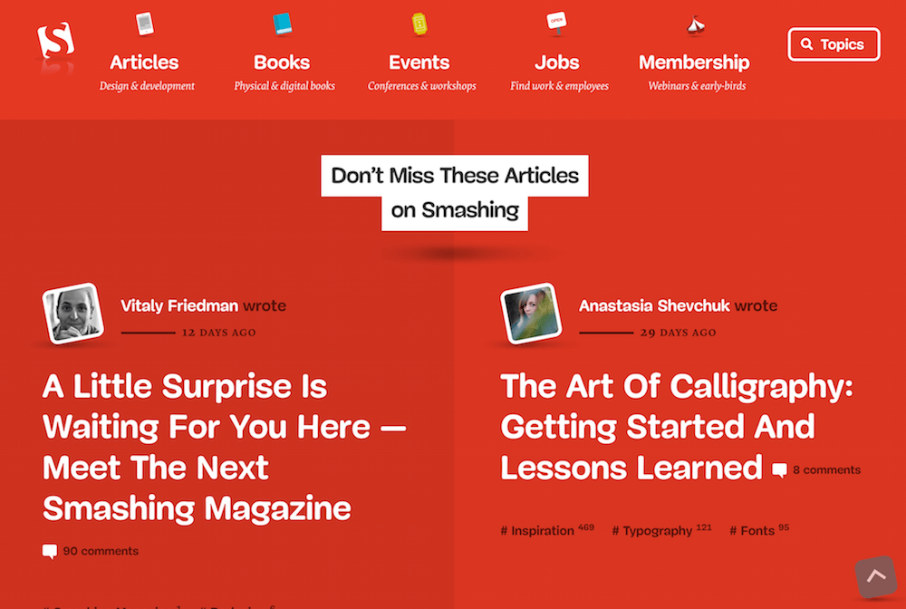

# 第四章：感知模式

*这个章节我们将讨论感知模式如何运作以及它们在设计系统中所扮演的角色*

想象一下我们各有一个屋子，有同一套的家具：一个桌子，一些椅子，一张床，一个衣柜。但是即使我们的家具是一样的，但是我们还是能够清晰的感知到其中的不同：它可能是由于家具的风格、材质、颜色、纹理、床单的编织物，内部的装饰物，房间的布局，灯光，或者是播放的音乐。我将这些属性称为感知模式。由于它们，你的房子可能会相波西米亚风格的巢穴，而我的则可能像是一个仓库。

在数字产品中的感知模式的例子包括：语气语调，排版，颜色使用，版式，插画和图标风格，形状，纹理，留白，图片，交互或者动画，以及这些元素在界面中组合使用的特定的组合。感知模式总是存在的，即使它们没有被有目的的进行设计。即使是一个存粹的功能性工具也具有美感。

有时候这种品质被视为产品顶层的造型或者皮肤。但是为了更有效，它们不仅呈现在表面，而且要生活在品牌的核心，它们必须跟随着产品一起发展。感知模式有效的时候，它们变为强大的产品差异化因素。

## 感知模式有助于表达品牌

### 图像

即使属于同一个领域或者含有相同的模块的产品也能让你感觉不同。为了写这本书，我尝试了十多个有着同样功能的文字处理器。但是只有几个，包含我现在在用的，能够有帮助我集中精神且富有成效的写作环境[^2]。我可以把它描述为干净和平静，展现出一种无拘无束的审美观，也就是把重点放在重要的事物上面，例如在线呈现文档，或者当我达成“写作目标”的时候，小圈圈变成绿色。这些环境是由某些模式的组合创造出来，尽管乍一看并不容易确定它们是什么。

让我们来举另外一个例子：Spotify。对我来说它让我觉得温暖和私密的。在这个拥有超过一亿月用户数字服务界面中，创造亲密氛围的模式到底是什么？除了功能，它主要是由图像样式，颜色组合（特别是绿色与黑色的比例），微妙和平静感的交互，以及排版的选择。

*Spotify 的亲密氛围是由感知模式组合，例如，微妙的交互，柔和的图像和跳脱的色彩。*

另一方面，**Smashing Magazine** 的俏皮，创造性，热情和略微另类的角色，通过一些系列不同模式的传达——从大胆的调色板和插图，到最小的细节，例如一些细微角度的界面元素。

*Smashing Magazine 的角色通过各种感知模式的组合来传达——从排版处理到图像和图标俏皮的角度。*

